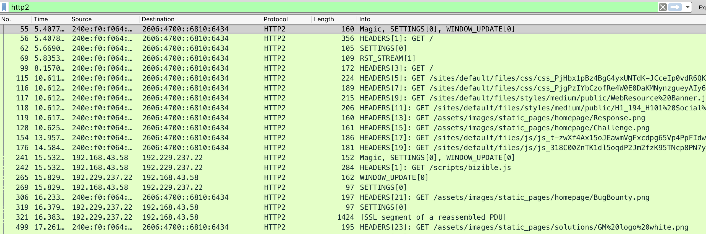

#### http2demo

1. load **hackerone.http2.out** with wireshark

2. open **Preference->Protocols->SSL**, find **(pre)-Master-secret-key log file** option , load the **sessions.random.key.txt**

   

#### References

[How to capture and decode HTTP/2 traffic with Wireshark](https://vanwilgenburg.wordpress.com/2015/11/22/how-to-capture-and-decode-http2-traffic-with-wireshark/)

[Supporting HTTP/2 for Website Visitors](https://www.nginx.com/blog/supporting-http2-google-chrome-users/)

[HTTP2.0配置](https://eggggger.xyz/2016/10/16/HTTP2/)

#### Caution

1. Openssl version must supports ALPN
2. If you want to enable server push characteristic, you must download the nginx version greater than 1.13.9 because the **http2_push** directive appears in version 1.13.9.

#### Appendix

| Operating System                       | OpenSSL Version | ALPN/NPN Support |
| -------------------------------------- | --------------- | ---------------- |
| CentOS/Oracle Linux/RHEL 6.5+, 7.0–7.3 | 1.0.1e          | NPN              |
| CentOS/Oracle Linux/RHEL 7.4+          | 1.0.2k          | ALPN and NPN     |
| Debian 7.0                             | 1.0.1e          | NPN              |
| Debian 8.0                             | 1.0.1k          | NPN              |
| Debian 9.0                             | 1.1.0f          | ALPN and NPN     |
| Ubuntu 12.04 LTS                       | 1.0.1           | NPN              |
| Ubuntu 14.04 LTS                       | 1.0.1f          | NPN              |
| Ubuntu 16.04 LTS                       | 1.0.2g          | ALPN and NPN     |

