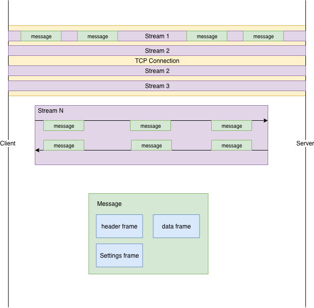
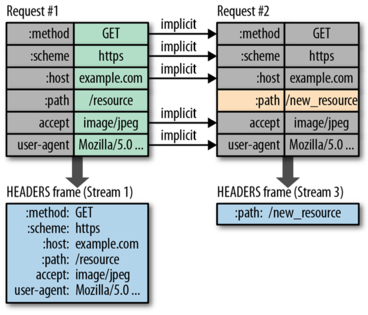

# High-Performance-Browser-Networking

[TOC]

### 延迟和带宽

提高网站响应速度---->提高用户黏度、忠诚度、转换率

带宽是指网络单位时间内传输的数据量

延迟是指消息从起点到终点的时间，通常由四部分组成：

1. 传播延迟，由传输距离和传输介质速度决定，光纤光速传播
2. 传输延迟，消息长度和链路速率决定，比如10Mb/s，发送100Mb的文件，时间是10秒
3. 处理延迟，消息途中经过的设备处理报文所造成的影响
4. 排队延迟，消息发送速度大于设备处理速度导致多余的消息存储在缓存区中进行等待

### TCP

#### 三次握手

所有TCP连接必须经历三次握手：

```
Client ----SYN----> Server								28ms
Server ----SYN & ACK----> Client						28ms
Client ----ACK----> Server								28ms
```

无论哪一端，都必须在收到ACK分组后才能发送数据。

```
Client ----SYN----> Server								28ms
Server ----SYN & ACK----> Client						28ms
Client ----ACK & Data----> Server						28ms
Server ----Data----> Client								28ms
```

#### 拥塞

由于Client一直没收到Server的响应，所以Client会持续向Server发送消息。而网络中的设备会收到该消息的副本，导致网络中设备的缓存区被填满，造成网络堵塞。

1. 流量控制算法，通过接收窗口（**rwnd**，receiver's advertised window）来实现，用于防止Client发送过多数据给Server。接收窗口大小**通过ACK分组互相通告**，每个ACK分组都会携带接收窗口。

通过交换接收窗口来实现流量控制，仅是防止了Client---->Server方向上的数据过多。如果Server向Client发送过多数据，同样也会导致网络拥塞。比如小明家带宽是10Mb/s，他正在看高清电影，服务器发送内容速率是8Mb/s，这个时候小明的弟弟打开了电脑开始下载软件占用了5Mb/s带宽，可服务器那边没收到通知，继续保持发送速率是8Mb/s，冗余的内容会同样会充斥在网络中造成网络拥塞。

2. 慢启动机制，通过动态调整（成倍增加TCP段）拥塞窗口（**cwnd**，congestion window）大小，Client在接受Server的ACK分组之前所能发送的最大数据量。Client与Server不进行拥塞窗口大小告知。

*Client*和*Server*之间传输的最大数据，取决于*拥塞窗口*和*接收窗口*中的最小值。

通常情况下，拥塞窗口小于接收窗口。当拥塞窗口超过接收窗口，**拥塞预防算法**介入调整拥塞窗口大小。

#### 队首拥塞（Head of Line Blocking）

TCP 在不可靠的信道上实现了可靠的网络传输，基本的分组错误检测与纠正、**按序交付**、丢包重发，以及保证网络最高效率的流量控制、拥塞控制和预防机制。

每个分组都会携带一个序列号，如果接收端收到的分组是缺失或者少了某个序列号的，那么应用程序需要等待TCP/IP协议栈接收到完整有序的分组。这段等待的时间称为**抖动**（*jitter*）。

### HTTP1.1

一个请求一个TCP Connection

1. 持久连接：一个TCP连接发送多个请求，通过Connection（keep-alive和close）头来实现。
2. HTTP管道：在三次握手后一次性发送多个请求

#### 为什么需要使用多个TCP连接

1. 客户端可以并行发送请求
2. 服务端并行处理多个请求

### HTTP2.0

HTTP 2.0 性能增强的核心，全在于新增的**二进制分帧层**(图 12-1)，它定义了如何封装 HTTP 消息并在客户端与服务器之间传输。 HTTP2.0 将所有传输的信息分割为更小的**消息**和**帧**，并对它们采用二进制格式的编码。



#### **Stream、Messages、Frame**

#### **Request Prioritization**

#### **Flow Control**

#### **Server Push**

#### **Header Compression**

>1. Instead of retransmitting the same data on each request and response, HTTP 2.0 uses “**header tables**” on both the client and server to **track and store** previously sent key-value pairs 
>
>2. Header tables persist for the entire HTTP 2.0 connection and are incrementally updated both by the client and server
>
>3. Each new header key-value pair is either appended to the existing table or replaces a previous value in the table
>
>   ​											《High-Performance-Browser-Networking》

Header update example



All header keys must be ***lowercase*** in HTTP2.0，ant the request line is now into individual *:method，:authority，:scheme，:path，*。

```http
GET /resources http/1.1
```

```
:method: GET
:authority: www.baidu.com
:path: /resources
:scheme: https
```

#### Efficient HTTP2.0 Upgrade and Discovery


## ToDo

### HTTP2.0

#### 为什么需要设计http2.0

For High Performance

#### HTTP2.0与http1.1的区别

HTTP2.0主要有4个特性：

1. 二进制协议
2. 多路复用
3. 头压缩
4. 服务器推送

#### http2.0的安全问题

#### 如何抓取http2.0数据包

#### ALPN和NPN是什么

NPN（Next Protocol Negotiation，下一代协议协商），是一个 TLS 扩展，由 Google 在开发 SPDY 协议时提出。随着 SPDY 被 HTTP/2 取代，NPN 也被修订为 ALPN（Application Layer Protocol Negotiation，应用层协议协商）。二者目标一致，但实现细节不一样，相互不兼容。以下是它们主要差别：

- NPN 是服务端发送所支持的 HTTP 协议列表，由客户端选择；而 ALPN 是客户端发送所支持的 HTTP 协议列表，由服务端选择；
- NPN 的协商结果是在 Change Cipher Spec 之后加密发送给服务端；而 ALPN 的协商结果是通过 Server Hello 明文发给客户端；

